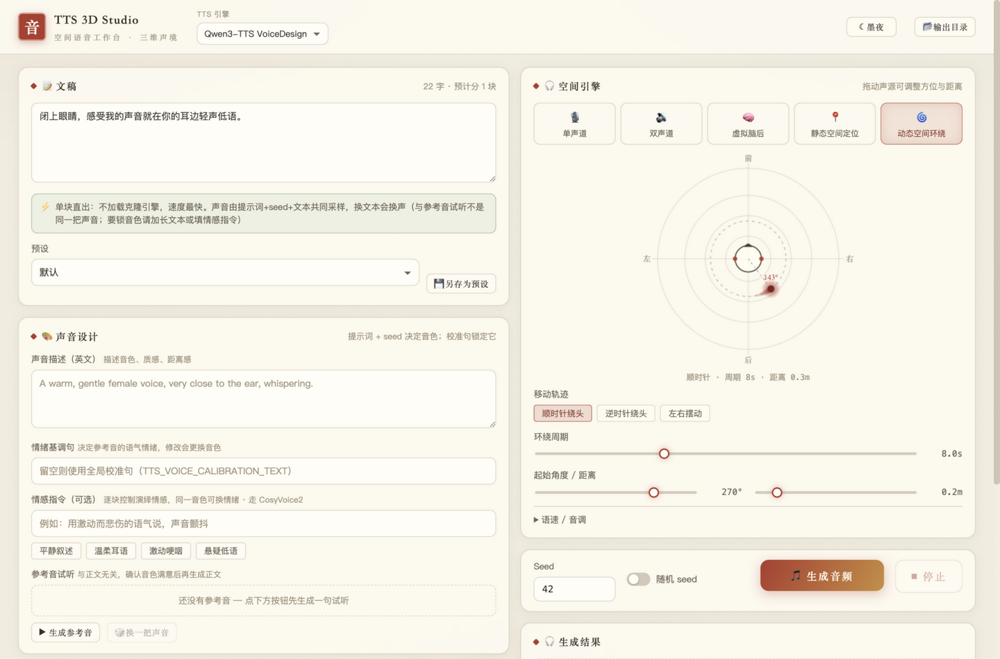
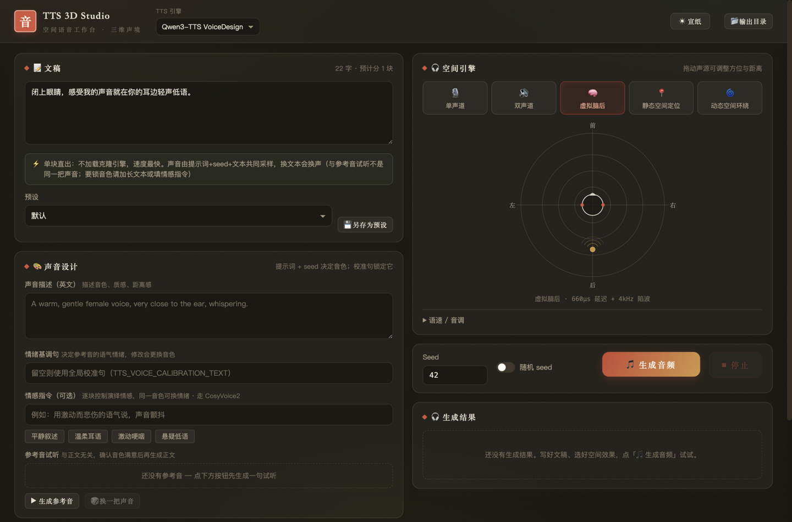
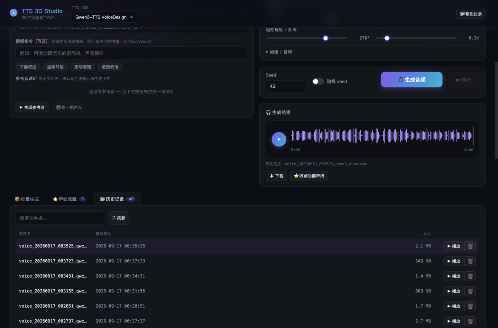

# TTS 3D Studio

TTS 3D Studio 是一个基于 `Qwen3-TTS` 的 3D 空间语音工作台，目前支持 VoiceDesign 文本描述生成与 Base Clone 参考音频克隆，提供 **Web UI（Vue3 + FastAPI，默认）**、Gradio UI（兼容备用）、CLI 和 MCP Server 四种使用方式。

## 界面预览

国风双主题：**宣纸**（默认，浅色）与**墨夜**（深色），可在界面右上角一键切换，偏好自动保存在浏览器本地。







## 已实现能力

- Qwen3-TTS VoiceDesign：文本 + 声音描述生成
- Qwen3-TTS Base Clone：参考音频 + 可选参考文本 + 生成文本模式
- 单声道、双声道、虚拟脑后、静态 HRIR、动态 HRIR 输出模式
- **Web UI 空间可视化**：俯视画布实时显示声源方位/距离，静态模式可直接拖拽声源，动态模式实时演示环绕轨迹（与后端轨迹公式一致）
- **生成全程进度反馈**：模型加载 → 校准参考音 → 逐块合成（第 i/n 块）→ 空间渲染 → 保存，SSE 实时推送；连接意外中断时自动从历史记录恢复结果
- 生成过程可随时停止：界面提供「停止」按钮，长文会在当前段的解码步进或段与段之间中断
- 干声缓存：相同引擎、模型和输入条件下切换空间效果时复用干声结果
- Qwen3-TTS 在 CUDA 环境下使用 FP16，并尝试启用 `torch.compile`；Apple Silicon（MPS）上使用 FP16 加速
- 超长文本按句/段分块生成后拼接，避免单次 `max_new_tokens=2048` 截断；VoiceDesign 用固定校准句生成参考音并落盘，之后每段（含短文）都从该参考音克隆，同一 prompt+seed 换稿子音色不变
- 动态 HRIR 轨迹预计算在可用时使用 Numba 加速
- MCP Server：支持通过 `python app.py mcp` 以 stdio 模式启动

## Web UI（默认界面）

`python app.py run` 默认启动 Web UI（FastAPI + Vue3 单页应用，构建产物随仓库提交在 `tts3d_app/webapp/static`，无需 Node 即可运行）。界面包含：

- 文稿面板：实时路由提示（⚡直出 / 🔒音色锁定 / 🎭情感克隆 / 🎙Base 克隆 + 块数）、字数与分块预估、预设管理与另存
- 声音设计面板：声音描述、情绪基调句、情感指令（快捷情绪 chips）、参考音试听与重抽
- 空间引擎面板：五种输出模式切换、俯视空间可视化画布（静态模式可拖拽声源）、静态/动态参数、语速/音调
- 生成区：seed 与随机开关、SSE 进度条（阶段 + 百分比 + 耗时）、停止按钮
- 结果面板：自绘波形播放器（点击定位）、状态详情、下载、收藏当前声线
- 底部标签页：批量生成（多 seed × 多效果，实时进度）、声线收藏卡片、历史记录（搜索/播放/删除）

前端源码在 `webui/`，修改后重新构建：

```bash
cd webui && npm install && npm run build
```

构建产物复制到 `tts3d_app/webapp/static` 后由 FastAPI 托管。开发模式可用 `npm run dev`（Vite 代理到 7860 端口的后端）。

## Gradio UI（兼容备用）

```bash
python app.py run --ui gradio
```

## 模型缓存目录

项目会把 Hugging Face 模型缓存统一写入一个固定目录。默认路径按平台选择：

- Windows：`E:\AI_Models\huggingface`
- macOS / Linux：`~/.cache/huggingface`

运行时会自动设置以下环境变量并创建目录：

- `HF_HOME`
- `HF_HUB_CACHE`
- `HUGGINGFACE_HUB_CACHE`
- `TRANSFORMERS_CACHE`

这意味着 Qwen3-TTS 下载的模型都会统一落到该目录下的 `hub` 子目录。可通过环境变量 `HF_HOME` 覆盖（macOS/Linux 上同时支持 `HUGGINGFACE_HUB_CACHE`）。

## 安装

建议使用 Python 3.12+。

```bash
pip install -r requirements.txt
```

如需自动识别参考音频文本，可额外安装 `faster-whisper`。

## 启动方式

启动 Web UI（默认）：

```bash
python app.py run
```

启动旧版 Gradio 界面：

```bash
python app.py run --ui gradio
```

检查环境与依赖状态：

```bash
python app.py doctor
```

执行最小生成测试：

```bash
python app.py smoke-test
```

以 stdio 模式启动 MCP Server：

```bash
python app.py mcp
```

## UI 使用说明

以下控件在 Web UI 与 Gradio UI 中语义一致（Web UI 的空间参数还提供画布拖拽交互）：

- `TTS 引擎`：`Qwen3-TTS VoiceDesign`、`Qwen3-TTS Base Clone`
- `模型`：根据引擎自动切换

当选择 `Qwen3-TTS VoiceDesign` 时：

- 显示 `声音描述`
- 显示 `情绪基调句`：请求级音色校准句，决定参考音的语气与情绪；留空则回退到全局 `TTS_VOICE_CALIBRATION_TEXT`。修改它会改变 `clip_id`，因此收藏声线会连同校准句一起保存
- 显示 `情感指令`：逐块控制演绎情感（如「用激动而悲伤的语气说」）。同一音色可换情绪——clip_id 不受影响。填写后自动改用 CosyVoice2 克隆引擎（Qwen Base 克隆无情感通道），也可用 `TTS_CLONE_ENGINE=cosyvoice2` 强制启用；下方提供常用情绪快捷按钮，收藏声线会连同情感指令一起保存
- 文本框下方实时提示本次生成路由（单块直出 / 音色锁定克隆 / 情感克隆 / Base 克隆）及块数
- 隐藏参考音频与参考文本输入

当选择 `Qwen3-TTS Base Clone` 时：

- 显示 `参考音频`
- 显示 `参考文本`，可留空；留空时使用 speaker embedding fallback，克隆质量通常低于填写准确参考文本
- `声音描述` 不参与生成

## CLI 参数

`smoke-test` 现在支持以下新增参数：

- `--tts-engine`: `qwen3` 或 `qwen3_base`
- `--tts-model`: 模型键
- `--reference-audio`: Qwen3 Base Clone 参考音频路径
- `--reference-text`: 参考音频对应文本，可选但推荐填写

Qwen3-TTS VoiceDesign 示例：

```bash
python app.py smoke-test --tts-engine qwen3 --tts-model "Qwen/Qwen3-TTS-12Hz-1.7B-VoiceDesign"
```

Qwen3-TTS Base Clone 示例：

```bash
python app.py smoke-test --tts-engine qwen3_base --tts-model "Qwen/Qwen3-TTS-12Hz-1.7B-Base" --reference-audio demo.wav --reference-text "Hello, this is the reference text."
```

## MCP 接入 Claude Desktop

将下面的配置加入 Claude Desktop 的 MCP 配置文件，并把路径替换为你的 `app.py` 绝对路径（macOS 请用 `python3` 与你的绝对路径）：

```json
{
  "mcpServers": {
    "tts-3d-studio": {
      "command": "python3",
      "args": ["/Users/tq/study/tts3d-studio/app.py", "mcp"]
    }
  }
}
```

MCP 工具名为 `generate_3d_speech`，主要参数包括：

- `text`
- `effect_type`: `mono`, `stereo`, `behind_head`, `static_hrir`, `dynamic_hrir`
- `voice_description`
- `seed`
- `tts_engine`: `qwen3`, `qwen3_base`
- `tts_model_key`
- `reference_audio_path`
- `reference_text`
- `static_azimuth_deg`
- `static_distance_m`
- `dynamic_path`: `clockwise`, `counterclockwise`, `side_to_side`
- `dynamic_cycle_time_s`
- `dynamic_start_azimuth_deg`
- `dynamic_distance_m`

除 `generate_3d_speech` 外，MCP Server 还提供 `batch_generate`（多种子/多效果批量生成）和 `list_outputs`（列出最近生成的音频）；引擎与模型能力可通过 `capabilities://tts` 资源读取。

## 运行说明

- 如果缺少 `hrir_spatial_map.npz`，程序仍可运行，但只提供基础模式和虚拟脑后模式。
- `doctor` 会输出 CUDA、MPS、SoX、flash-attn、numba、fastmcp、ASR 等依赖状态。
- 如果本机支持 CUDA，Qwen3-TTS 使用 FP16 推理，并开启 TF32；如果本机是 Apple Silicon（MPS），同样使用 FP16。低显存时回退 FP32。
- 超长文本会按句/段切开多次生成再拼接（默认每段不超过 400 字）。VoiceDesign 会按声音描述生成一句与正文无关的校准参考音并缓存，随后各段（含短文）都用该参考做 Base Clone（ICL）。同一 prompt + seed 换稿子会复用同一把声音。Qwen 单次 `max_new_tokens` 默认 2048，大约 2.7 分钟，整篇一次送入会在后半段消音或失真。
- 音频空间处理（HRIR 卷积、变调）在无 CUDA 时自动回退到 CPU 路径。
- Qwen3-TTS Base Clone 需要参考音频；参考文本可手动填写，也可在安装 ASR 后自动识别。
- 把 `hrir_spatial_map.npz` 放到项目根目录后才会启用静态/动态 HRIR。文件需包含 `hrir_L`、`hrir_R`、`azimuths`、`distances`。仓库不附带该数据文件。

## 可调环境变量

- `QWEN_TTS_MODEL`: 指定当前 Qwen3-TTS 模型名
- `QWEN_TTS_BASE_MODEL`: 指定当前 Qwen3-TTS Base Clone 模型名
- `APP_SERVER_NAME`: 指定 Gradio 监听地址
- `TTS3D_OUTPUT_DIR`: 指定音频输出目录，默认为 `outputs`
- `CLEAR_CUDA_CACHE_AFTER_GENERATE=1`: 每次生成后清理 CUDA Cache
- `ENABLE_TORCH_COMPILE=0`: 关闭 `torch.compile`
- `TORCH_COMPILE_MODE`: 默认 `reduce-overhead`
- `DRY_AUDIO_CACHE_SIZE`: 干声缓存条目数，默认 `32`
- `MAX_TTS_CHUNK_CHARS`: 长文本每段最大字符数，默认 `400`
- `TTS_MAX_NEW_TOKENS`: 每段 Qwen 生成的 codec token 上限，默认 `2048`
- `TTS_CHUNK_SENTENCE_PAUSE_MS`: 句间拼接静音，默认 `300`
- `TTS_CHUNK_PARAGRAPH_PAUSE_MS`: 段间拼接静音，默认 `700`
- `TTS_SPEAKER_REF_MAX_CHARS`: VoiceDesign 校准句最大字数，默认 `60`；设为 `0` 关闭音色锁定
- `TTS_VOICE_CALIBRATION_TEXT`: VoiceDesign 音色锁定用的固定校准句，与正文无关；UI 中的「情绪基调句」输入框可在单次请求内覆盖它
- `TTS_CLONE_ENGINE`: 音色锁定链路的克隆引擎，`auto`（默认，填情感指令时用 CosyVoice2，否则用 Qwen3 Base）/ `qwen3_base` / `cosyvoice2`
- `TTS_DIRECT_SINGLE_CHUNK=0`: 恢复旧行为——单块短文本也走音色锁定克隆（默认短文直出，快且省一个模型，但同提示词+seed 换文本会换声音）
- `COSYVOICE_REPO_DIR` / `COSYVOICE_MODEL_DIR`: CosyVoice2 源码与权重的本地路径（搭建方式见 `tools/cosyvoice_experiment/run_emotion_experiment.py` 顶部说明）
- `ENABLE_GPU_FFT_CONVOLUTION=0`: 关闭 torchaudio GPU FFT 卷积路径
- `ENABLE_NUMBA_DYNAMIC_HRIR=0`: 关闭动态 HRIR 的 Numba 轨迹规划

## 测试

运行全部单元测试：

```bash
python -m unittest discover -s tests
```

分析拼接后长音频的段间 F0 / 谱漂移：

```bash
python -m tts3d_app.timbre_report path/to/audio.wav
```

段间 F0 均值偏移不超过 10Hz 视为音色锁定有效。

当前测试覆盖了：

- FFT 卷积与时域卷积结果一致性
- 动态 HRIR 最后一帧重叠写入安全性
- 动态 HRIR 轨迹规划正确性
- 服务层按引擎和模型选择 provider
- 干声缓存会因引擎、模型和参考音频变化而失效
- 超长文本会按句分块调用 TTS 再拼接
- VoiceDesign 用固定校准句生成参考音并落盘，各段（含短文）都从该参考音克隆；同一 prompt+seed 换稿子会复用 clip
- 生成中途取消会在分块边界停止，且不会写出音频文件
- 删除音频只能作用在输出目录内
- Qwen3-TTS Base Clone 缺少参考音频时返回明确错误
- Gradio/CLI/MCP 暴露新的引擎和模型参数
- Web API：meta/路由提示/SSE 生成流（含进度与终态事件）/历史增删/收藏增删/媒体文件目录穿越防护
- Hugging Face 缓存目录环境变量设置正确
